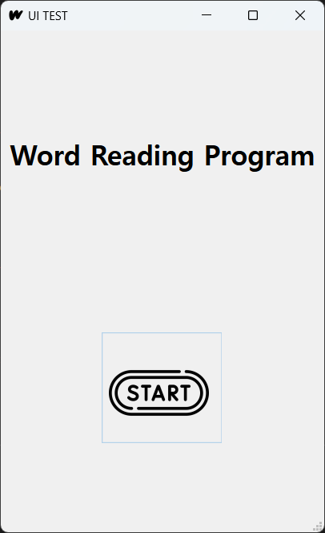

# WRP

## 1. 프로젝트 소개
### 프로젝트 추진 배경
최근 코로나 방역 완화로 다시 활발해진 해외여행으로 인해서 외국으로 놀러 나가거나 공부를 위해 출국하는 사람들이 잦아졌다. 그런 사람들을 잘 관찰해보니 언어를 학습하여 번역기나 통역기가 아닌 직접 대화를 나누는 것에 대한 로망을 실천하고 싶어하며, 어학 공부에 뛰어든 사람들의 수가 증가하였다. 
새로운 언어를 배우려는 사람들에게 단어 익히기가 필수이다. 그러나 대부분의 사람들이 하나의 단어를 반복하여 외우고, 다음 단어로 넘어가는 등의 단어 외우기 방법을 사용한다. 그러한 방법은 단어를 외웠다 하더라도 지속시간이 짧아 무용지물이나 마찬가지이다. 단어를 편하게 외울 수 있되, 자신이 외운 단어와 아직 외우지 못한 단어를 관리할 수 있는 간단한 수단의 필요성이 커지고 있다.
최근 기사를 통해서 효과적인 단어 암기 법을 알게 되었다. 단어를 쉽게 암기할 수 있도록 하고, 최근 수강중인 강의의 목적인 오픈소스로 여러 프로젝트를 공유하고 공유 받는 것을 실천해보고자 이러한 프로젝트를 추진하게 되었다.

### 프로젝트 소개
등록되어 있는 여러 단어들을 단어장의 형태로 제공하여 질리지 않도록 단어를 외울 수 있는 회독의 방법을 사용한 암기용 단어장이다.

## 2. 개발기간
* 23.04.13 - 23.06.07

## 3. 구현 기능 소개
* 단어장 앱을 실행한다.

* 입력된 단어장들을 확인할 수 있다.

* 입력되어있는 단어장을 확인하여 단어장 안의 단어를 하나씩 확인하며 외울 수 있다.

* 단어장에 들어있는 단어들을 미리 확인할 수 있다.

## 4. 사용자 가이드
### 배경
* GitHub Repository를 컴퓨터에 clone한다.
* cmd 창에 'pip install pyside6'를 입력하여 pyside6를 컴퓨터에 설치한다.

### 사용
프로그램 실행
- main.py 파일 실행

단어장 추가
- 다운받은 Repository 로컬 파일에 들어가 wordfile에 원하는 sheet와 단어들을 단어 - 뜻 순서대로 입력한다.
next 버튼을 눌러 다음 단어로 넘어가며 단어를 회독한다.

단어장 삭제
- 삭제하고싶은 단어장을 선택한 뒤 삭제버튼을 누른다. 단, 복구할 수 없으니 유의하도록 한다.

단어장 확인
- 확인하고싶은 단어장을 선택한 후 '리스트 확인'을 눌러서 확인한다.

